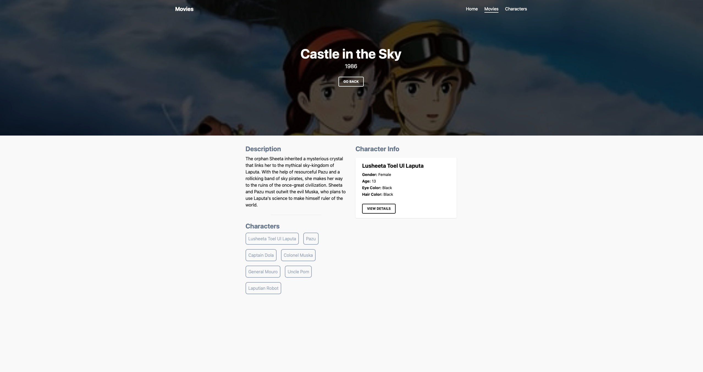
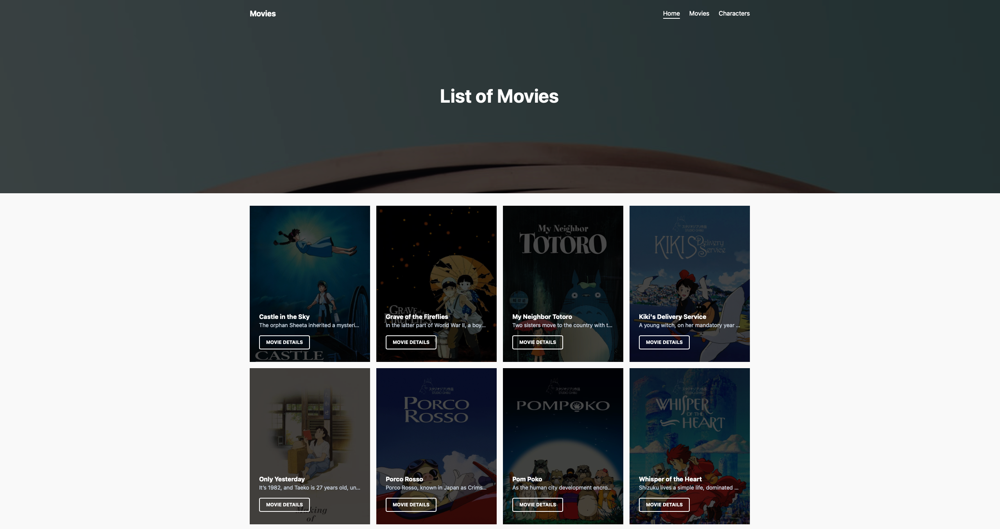

<h1 align="center">Remix Movies App</h1>

  

<h2>💡 What you will found?</h2>

This repo is created following the [Marius Espejo video](https://www.youtube.com/watch?v=HOlYQu_r4Io) with some changes.

- For the movies list is used [ghibliapi](https://ghibliapi.herokuapp.com) (free API without authentication);
- For the comments, is used the `json-server` package;
  - This feature is not on deployed version.

  

<h3 style="font-weight: 300">
🧑🏻‍💻 About Me
</h3>

<a href="https://github.com/TutoDS" alt="TutoDS">

 
 <b>Daniel Sousa @TutoDS</b>
</a>

[facebook]: https://facebook.com/tutods2014
[twitter]: https://twitter.com/tutods
[youtube]: https://youtube.com/tutods2014
[instagram]: https://instagram.com/dsousa_12
[linkedin]: https://www.linkedin.com/in/daniel-sousa-tutods/
[gitlab]: https://gitlab.com/jdaniel.asousa

[][facebook] [][twitter]

[][linkedin] [][instagram]

[][youtube] [][gitlab]

